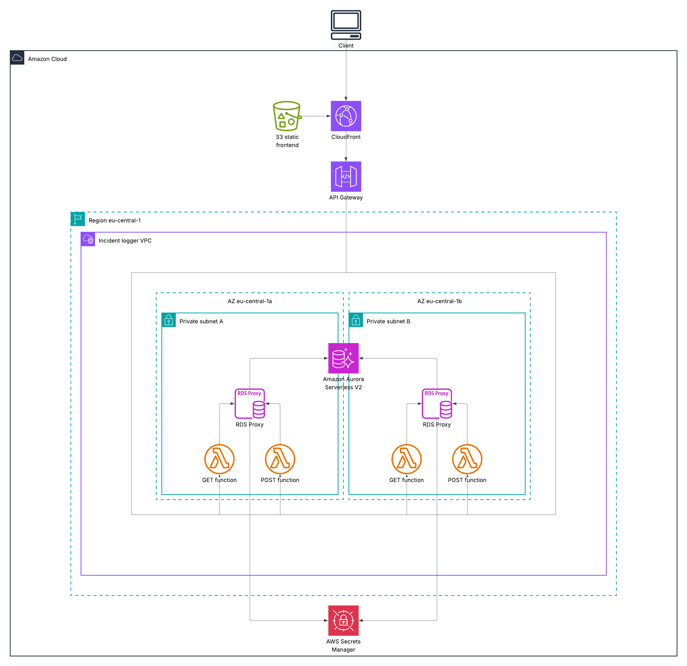
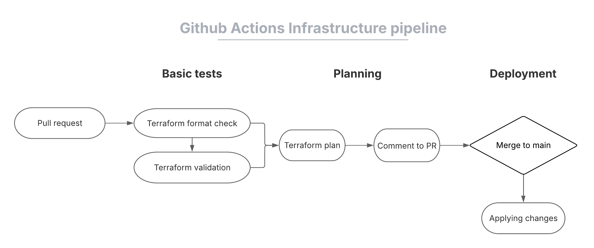
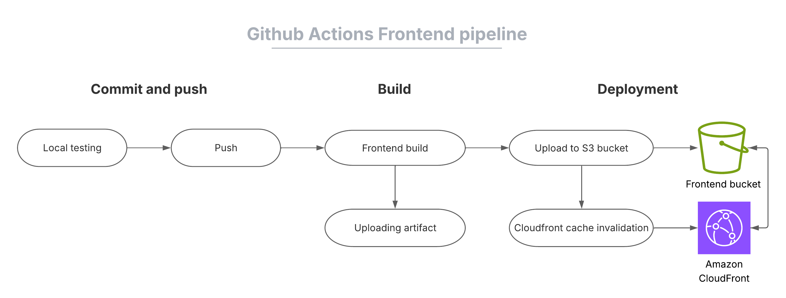
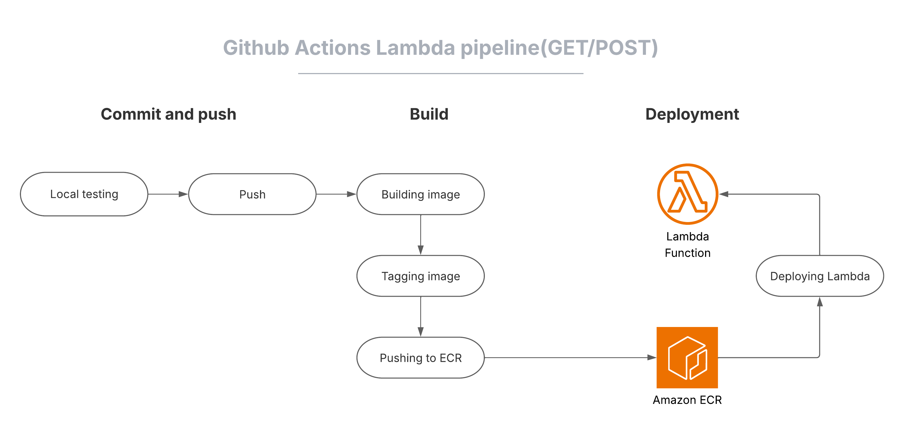
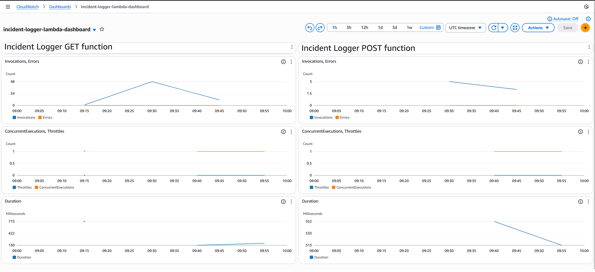
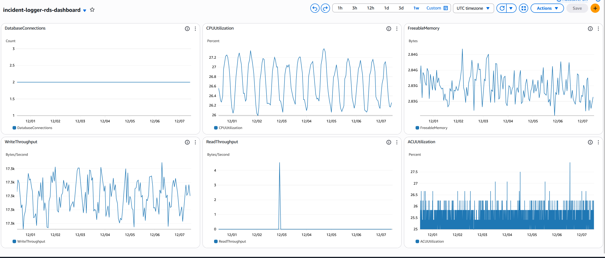
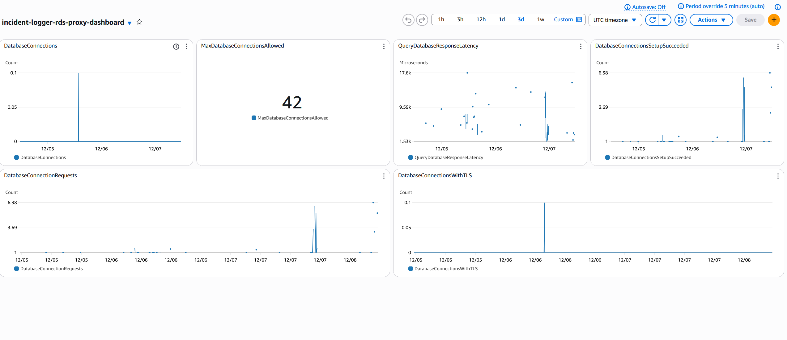
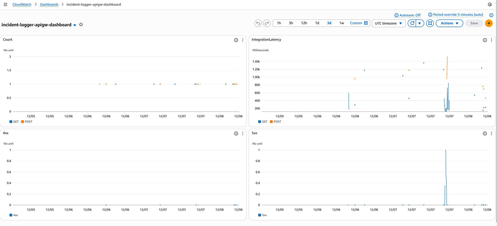
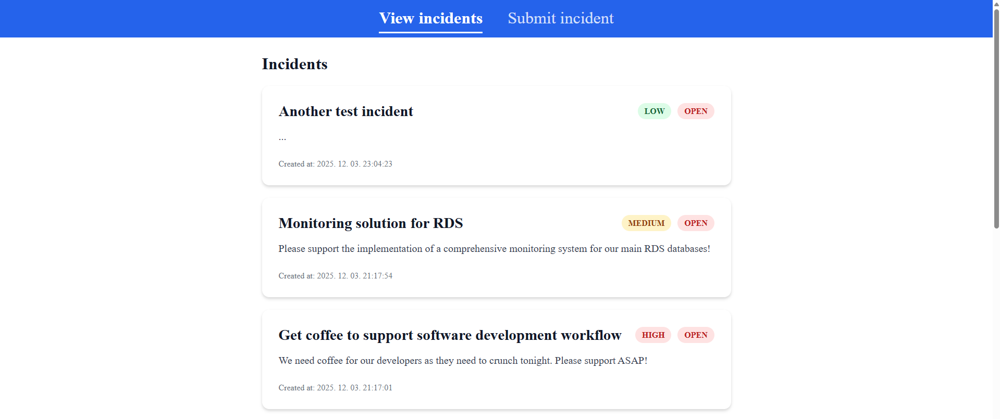
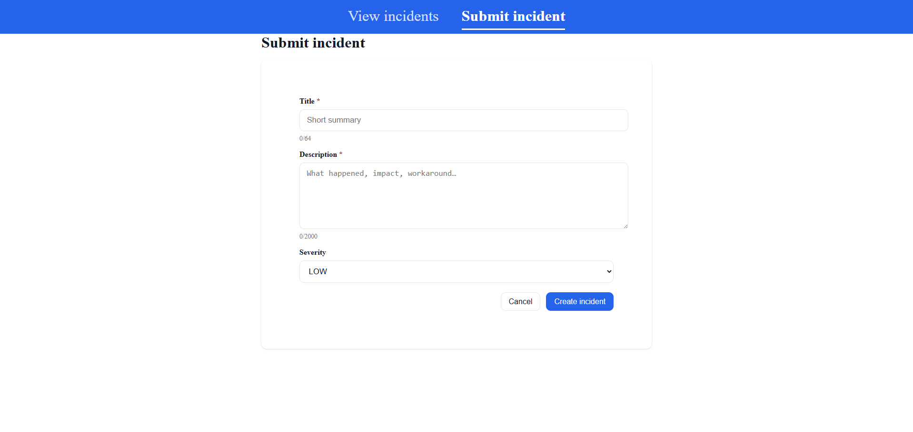

# Serverless Incident Logger
This is the serverless version of my previous [incident logger](https://github.com/tiborenyedi96/incident-logger) project.  
I have built this project after passing the AWS Solutions Architect Associate certification exam to apply my skills in practice by designing and building a secure, scalable and cost-effective application in the cloud using only serverless components, following IaC principles with Terraform, and building Github Actions pipelines for automation and efficiency. I used serverless components to build an architecture with low day-to-day operational demand. The main focus of this project is the infrastructure which I built entirely using Terraform in a modular structure to deepen my understanding of AWS and prepare for the HashiCorp Certified Terraform Associate exam. 

## Architecture Diagram:

## Github Actions Infrastructure CI/CD Diagram:

## Github Actions Frontend CI/CD Diagram:

## Github Actions Lambda CI/CD Diagram:

## Cloudwatch dashboards:

### Lambda cloudwatch dashboard:

### RDS cloudwatch dashboard:

### RDS Proxy cloudwatch dashboard:

### API Gateway cloudwatch dashboard:

## Application UI:

### Incident List View:

### Submit New Incident:

## Key Features:

- Fully serverless AWS architecture (CloudFront, S3, API Gateway, Lambda (with arm64 architecture for cost effectiveness), Aurora Serverless v2)
- IaC with Terraform (modular structure, remote backend with S3 + DynamoDB for versioning and state-locking)
- Automated CI/CD pipelines using GitHub Actions for infrastructure, frontend and backend
- Secure VPC design with private subnets and minimal security group rules
- Cost-efficient, scalable, low-maintenance solution

## Tech Stack:
- **Cloud platform:** AWS
- **IaC:** Terraform
- **CI/CD:** GitHub Actions
- **Frontend:** Vue.js

## High Level Overview Of The Architecture:

### Frontend and API Layer:
The frontend of the application is a simple SPA developed in Vue.js. It only has basic functionality since it is not the main focus of this project, but it could be easily expanded further. Users are connecting to cloudfront which fetches the frontend's data from a private S3 bucket configured with origin access control and forwards the requests to an API Gateway. 
**Data Flow: Client -> Cloudfront with S3 OAC -> API Gateway**

### Backend and Database Layer:
The backend utilizes multiple AWS services. It sits inside a VPC with two private subnets in separate availability zones. Public subnets/NAT gateways/Internet gateways are not included by design since the components of the architecture do not require internet connection so it is much more cost-effective and more secure to exclude them and it is also easy to add them later if requested. The security group rules are also designed with a security first mindset since they only enable egress communication within the boundaries of the VPC and only allow ingress communication where needed. I have also tried to minimize IAM permissions and using IAM authentication and also OIDC for pipelines/components where I could to minimize the usage of traditional secrets. IAM was one of the biggest challenges during the development but at least now I understand why lots of engineers say that IAM is hard and I have also learned a lot about it. 
**Data Flow: API Gateway -> Invoke GET/POST Lambda function based on request method -> RDS Proxy for database connection management -> Insert/Fetch data into/from Amazon Aurora Serverless v2 -> Response to API gateway**

## Design Decisions & Evolution:

This project went through several iterations as I learned and optimized the architecture and I still work on it to make it better. Let me show you some of the key decisions I made during development:

### Decision 1: Separation of Application and Infrastructure Lifecycle:

**Initial Approach:** I wanted to deploy the frontend build to S3 via Terraform.

**Problem Identified:** I have used my hobby game development experience where I learned separation of concerns is one of the most important design principles and realized if I deploy the frontend with Terraform I will create a tightly coupled architecture where the application and infrastructure components would be too dependent on each other.

**Solution:** Learned the basics of Github Actions and introduced it to the project to separate application and infrastructure lifecycle. In the end I started to like Github Actions and I found it interesting and useful so I started to introduce more pipelines.

### Decision 2: Containerized Lambda Functions:

**Initial Approach:** Zip file artifacts for Lambda deployment.

**Problem Identified:** Zip files are harder to version, have a small file size limit, hard to test locally, and not evident to integrate into CI/CD pipelines consistently. If you want to use zip files you also need to include dependencies in the zip file if your lambda code uses an external library.

**Solution:** Migrated to containerized Lambda functions with ECR and automated image building in CI/CD.

### Decision 3: ARM64 Architecture for Lambda:

**Initial Approach:** x86_64 Lambda functions (this is the default behaviour)

**Optimization Identified:** AWS Graviton (arm64) processors most of the time offer better price/performance ratio for small compute workloads so I have decided to try them in my functions.

**Solution:** Migrated Lambda functions to arm64 architecture and updated CI/CD pipelines to build arm64 container images.

## Future Improvements:
- Add monitoring with CloudWatch dashboards for observability
- Constantly refactoring Terraform code, reducing repeated elements and hardcoded values and improving the reusability of my modules
- Trying different experiments in AWS Fault Injection Service to see where my infrastructure has its limits and planning fixes to address them